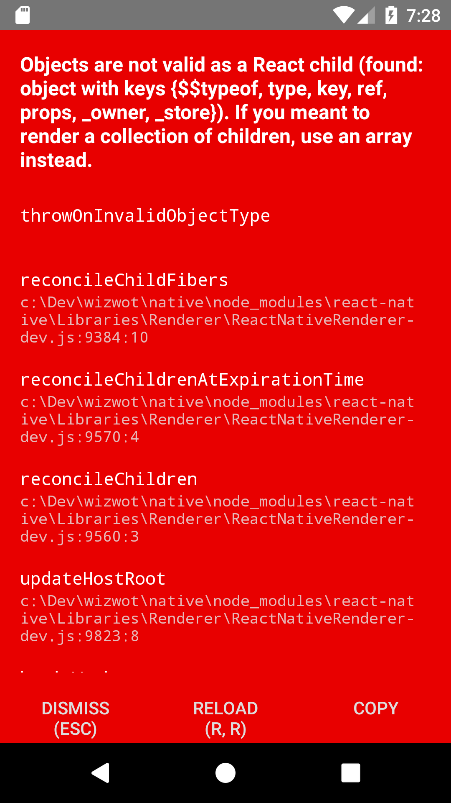

# React-Native WebView RPC
[](https://www.npmjs.com/package/rn-webview-rpc)
[](https://www.jsdelivr.com/package/npm/rn-webview-rpc)
[](https://travis-ci.org/ronhe/rn-webview-rpc)

RN-WebView-RPC's goal is to allow calls to native API from a web
application that runs inside a `WebView` component, and vice versa.
It can be used as a bridge between the native and the web
parts of hybrid apps, for example,
requesting native geo-location permissions from withing a `WebView`.

RN-WebView-RPC integrates the built-in
[WebView](https://facebook.github.io/react-native/docs/webview.html)
component together with the useful
[Comlink](https://github.com/GoogleChromeLabs/comlink)
library into an easy-to-use package.

```javascript
// App.js

import React from 'react';
import { View, Alert } from 'react-native';
import WebViewRpc from 'rn-webview-rpc/native';
import html from './index.html';

export default class App extends React.Component {
  render() {
    return (
      <View style={{ flex: 1 }}>
        <WebViewRpc
          style={{ marginTop: 0, flex: 1 }}
          source={html}
          exposedObj={{ Alert }}
          injectScriptTag
        />
      </View>
    );
  }
}
```

```javascript
// index.html

const proxy = rnRpc.proxy();
await proxy.Alert.alert(
    'What is your favorite color?',
    'We got green and blue',
    [
      {text: 'Ask me later'},
      {text: 'Green', onPress: rnRpc.proxyValue(() => setBgColor('green'))},
      {text: 'Blue', onPress: rnRpc.proxyValue(() => setBgColor('blue'))},
    ],
    { cancelable: false }
);
    
function setBgColor(color) {
  document.body.style.backgroundColor = color;
}
```

## Installation
### React-Native End Installation
Install `rn-webview-rpc` from NPM:
```
$ npm install --save rn-webview-rpc
```
Then import the `WebViewRpc` component:
```javascript
import WebViewRpc from 'rn-webview-rpc/native';
```

**Note**: If you encounter this error:
> Objects are not valid as a React child... 



then you should add
```javascript
import 'core-js/es6/symbol';
```
at the top of your app's JavaScript entry point. 

### Web End Installation
You can either install from a CDN or from NPM.
#### Install from NPM
Install `rn-webview-rpc` from NPM (exactly as for the React-Native project):
```
$ npm install --save rn-webview-rpc
```
Then import the `rnRpc` object:
```javascript
import rnRpc from 'rn-webview-rpc/web';
```
### Install from a CDN
Add a `script` tag to your HTML's `head`:
```html
<script src="https://cdn.jsdelivr.net/npm/rn-webview-rpc@1.2.2></script>
```
Or let the `WebViewRpc` component do that for you, by setting the
`injectScriptTag` prop to `true`.
Either way,  the `rnRpc` object becomes available globally. 

**Warning**: 
Make sure that both ends (React-Native and web) use compatible versions
of `rn-webview-rpc` by enforcing matching identical versions.
If you choose installation from a CDN using the `injectScriptTag`,
then it is taken care of automatically. 

## React-Native API - `WebViewRpc` 
A React-Native component that renders a
[`WebView`](https://facebook.github.io/react-native/docs/webview.html)
component with a bi-directional RPC bridge.
### Props
#### `exposedObj`
The object to be exposed to the web end.
* Type: object
* Default: `{}`
#### `injectScriptTag`
Controls whether to inject a `script` tag to
load the `rn-webview-rpc` module to the website.
* Type: bool
* Default: `false`
#### `onMessage(listener)`
Allows an extra custom listener of `'message'` events.
* Type: function
* Default: `undefined`
#### `target`
An object interface for proxy calls.
It is required if you intend to invoke calls from native end to the web end
(using the `proxy` attribute). 
* Type: object
* Default: `{}`

*The rest of the props are being forwarded to the native
`WebView` component.*

### Instance Attributes
*Hint*: A React class component instance is accessible using the `ref` prop:
```javascript
<WebViewRpc
    ref={(ref) => {
      this.webViewRpc = ref;
    }}
/>
```
#### `proxy`
an ES6 `proxy` polyfill that sends all operations performed on that proxy
to the native side. It is similar to
[Comlink's `proxy` function](https://github.com/GoogleChromeLabs/comlink#comlinkproxyendpoint)
but can only be called within the interface defined by the `target` prop.

#### `webView`
A reference to the native `WebView` instance.

### Static Class Methods
#### `proxyValue(value)`
A wrapper function to let a parameter or a return value
be proxied rather than copied.
This is just a reference to
[Comlink's `proxyValue` function](https://github.com/GoogleChromeLabs/comlink#comlinkproxyvaluevalue)

## Web API - `rnRpc`
An object at the web end that provides a bi-directional RPC bridge
to the native end.
### `Functions`
#### `proxy(target)`
creates an ES6 `proxy` that sends all operations performed on that proxy
to the native side.
`target` argument is an object interface for proxy calls, which
is required in browsers that do not support the ES6 `proxy`.
`proxy` returns an ES6 `proxy` object exactly like
[Comlink's `proxy` function](https://github.com/GoogleChromeLabs/comlink#comlinkproxyendpoint)
(or a proxy object polyfill in old browsers).
#### `proxyValue`
A wrapper function to let a parameter or a return value
be proxied rather than copied.
This is just a reference to
[Comlink's `proxyValue` function](https://github.com/GoogleChromeLabs/comlink#comlinkproxyvaluevalue)
#### `expose(obj)`
Exposes an object to the native end.
It just wraps
[Comlink's `expose` function](https://github.com/GoogleChromeLabs/comlink#comlinkexposeobj-endpoint)
. 

## Limitations
Exposing an object in the native side requires providing a
`target` interface at creation time.
This is because the JavaScript engine 
[JavaScriptCore](https://trac.webkit.org/wiki/JavaScriptCore)
used by React-Native does not support the ES6 `proxy` object,
and its polyfill
[proxy-polyfill](https://github.com/GoogleChrome/proxy-polyfill)
is limited.
Same applies for the web end for old browsers.

## Example
See the [example folder](https://github.com/ronhe/rn-webview-rpc/tree/master/example).
It is a very simple React-Native app bootstrapped with the
[Create React Native App](https://github.com/react-community/create-react-native-app)
tool.
You can play with it online thanks to
[Expo Snack](https://snack.expo.io/@git/github.com/ronhe/rn-webview-rpc:example)
(If you're asked to add packages to the *package.json* - accept the offer).

## Under the Hood
> Reading this section is most definitely optionally :)

The major pain coding this package was helping the
delightful Comlink library to work in the native environment (and old browsers).
Comlink is designed for web workers environment, and
unfortunately the native JavaScript engine is more limited.
1. `WebView`'s messaging interface supports only string messages.
Thankfully, solving this issue was easy,
since the Comlink library already includes a
[`MessageChannelAdapter`](https://github.com/GoogleChromeLabs/comlink/blob/master/messagechanneladapter.ts),
to support string based message channels, such as WebRTC.
What remained to be done is to translate the
`postMessage`/`onMessage` WebView's message API to a
`send`/`addEventListener` endpoint.
2. The ES6 `proxy` object is unsupported natively. This was solved using the
[Proxy Polyfill](https://github.com/GoogleChrome/proxy-polyfill)
(with some 
[limitations](https://github.com/ronhe/rn-webview-rpc#limitations)).
Moreover, to allow `proxy` to work in React-Native, a few changes
were required in
[Comlink](https://github.com/GoogleChromeLabs/comlink). 
Untill the relevant
[PR](https://github.com/GoogleChromeLabs/comlink/pull/113)
is merged, `rn-webview-rpc` uses a
[fork](https://github.com/ronhe/comlink) dependency.

3. The `MessageChannel` and `MessagePort` objects are missing
in the native environment. Since no polyfills are available, 
to address this problem I had to write pretty
simple degenerated polyfills.

4. More polyfills: The `Object` and `ArrayBuffer` behave slightly
inconsistently in different environments. Hence, I have them
overridden by polyfills when necessary.