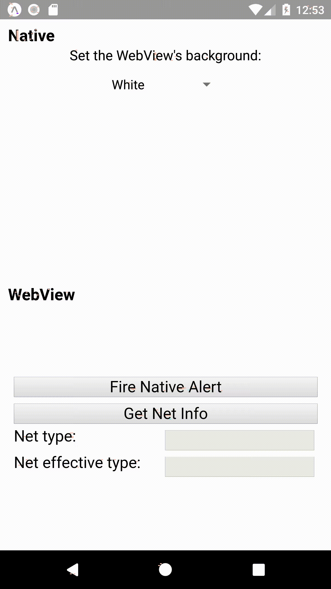

# React-Native WebView RPC
[](https://www.npmjs.com/package/rn-webview-rpc)
[](https://www.jsdelivr.com/package/npm/rn-webview-rpc)
[](https://travis-ci.org/ronhe/rn-webview-rpc)

RN-WebView-RPC's goal is to allow calls to native API from a web
application that runs inside a `WebView` component, and vice versa.
It can be used as a bridge between the native and the web
parts of hybrid apps, for example,
requesting native geo-location permissions from withing a `WebView`.

RN-WebView-RPC integrates React-Native's
[WebView](https://github.com/react-native-community/react-native-webview)
component together with Google's
[Comlink](https://github.com/GoogleChromeLabs/comlink)
library into an easy-to-use package.

For example, the snippet below allows opening a native alert that lets 
the user to choose the background color of the html web page.

```javascript
// App.js

import React from 'react';
import { View, Alert } from 'react-native';
import WebViewRpc from 'rn-webview-rpc/native';
import html from './index.html';

export default class App extends React.Component {
  render() {
    return (
      <View style={{ flex: 1 }}>
        <WebViewRpc
          style={{ marginTop: 0, flex: 1 }}
          source={html}
          exposedObj={{ Alert }}
          injectScriptTag
        />
      </View>
    );
  }
}
```

```javascript
// index.html

const proxy = rnRpc.proxy();
await proxy.Alert.alert(
    'What is your favorite color?',
    'We got green and blue',
    [
      {text: 'Ask me later'},
      {text: 'Green', onPress: rnRpc.proxyValue(() => setBgColor('green'))},
      {text: 'Blue', onPress: rnRpc.proxyValue(() => setBgColor('blue'))},
    ],
    { cancelable: false }
);
    
function setBgColor(color) {
  document.body.style.backgroundColor = color;
}
```

## Installation
### React-Native End Installation
First, install the `react-native-webview` peer dependency, by following the
instruction [here](https://github.com/react-native-community/react-native-webview/blob/master/docs/Getting-Started.md#react-native-webview-getting-started-guide).
For most projects, that would be:
```bash
$ npm install --save react-native-webview
$ react-native link react-native-webview
```

Then, install `rn-webview-rpc` from NPM:

```bash
$ npm install --save rn-webview-rpc
```

Finally, in your code, import the `WebViewRpc` component:
```javascript
import WebViewRpc from 'rn-webview-rpc/native';
```

**Note**: If you encounter this error:
> Objects are not valid as a React child... 


then you should try adding
```javascript
import 'core-js/es6/map';
import 'core-js/es6/symbol';
```
at the top of your app's JavaScript entry point.
See [this thread](https://github.com/facebook/react-native/issues/18542)
for more info. 

### Web End Installation
You can either install from a CDN or from NPM.

#### Install from NPM
Install `rn-webview-rpc` from NPM (exactly as for the React-Native project):
```bash
$ npm install --save rn-webview-rpc
```
Then, in your code, import the `rnRpc` object:
```javascript
import rnRpc from 'rn-webview-rpc/web';
```
#### Install from a CDN
##### Install from a CDN automatically
Let the React-Native `WebViewRpc` inject an HTML script tag to the website,
by setting the `injectScriptTag` prop to `true`:
```javascript
<WebViewRpc
  ...
  injectScriptTag
/>
```

##### Install from a CDN manually
Add a `script` tag to your HTML's `head`:
```html
<script src="https://cdn.jsdelivr.net/npm/rn-webview-rpc@2.0.0-alpha.1></script>
```

Either way (after a manual or automatic installation) the `rnRpc` object
becomes available globally.

**Warning**:
When manually installing `rn-webview-rpc` on the web end
(either from NPM or CDN), it's your responsibility to make sure that
both ends (React-Native and web) use compatible versions
of `rn-webview-rpc`.
However, when installing automatically from a CDN by using the `injectScriptTag`,
this burden is inherently taken care of for you.


## React-Native API - The `WebViewRpc` component 
A React-Native component that renders a
[`WebView`](https://github.com/react-native-community/react-native-webview)
component with a bi-directional RPC bridge.
### Props
The following props are consumed by the `rn-webview-rpc` component.
Additional props are forwarded to the `react-native-webview`'s
`WebView` component.
#### `exposedObj`
The React-Native object to be exposed to the web end.
* Type: object
* Default: `{}`
#### `injectScriptTag`
Controls whether to inject a `script` tag to automatically
load the `rn-webview-rpc` module to the website.
* Type: bool
* Default: `false`
#### `onMessage(listener)`
Allows an extra custom listener to `message` events
(except for the one that is already configured in order to take care of the
RPC functionality).
* Type: function
* Default: `undefined`
#### `target`
An interface object for proxy calls.
It is required for invoking calls from the React-Native end to the web end
(using the `rnRpc`'s `proxy` attribute). 
* Type: object
* Default: `{}`

### Methods and Attributes
*Hint*: A React class component instance is accessible using the `ref` prop,
for example:
```javascript
<WebViewRpc
    ref={(ref) => {
      this.webViewRpc = ref;
    }}
/>
```
#### `proxy`
An ES6 `proxy` polyfill that sends all operations performed on it
to the web side. It is essentially a proxy object returned by
[Comlink's `proxy` function](https://github.com/ronhe/comlink#comlinkproxyendpoint).
However, due to limitations of the `proxy` polyfill
(with respect to the ES6 `proxy`), it is limited to the interface defined 
beforehand by the `target` prop. This limitation will be resolved once
React-Native updates its JavaScript engine to a modern one,
probably in React-Native@0.60.

#### `webView`
A reference to the native `WebView` component instance.

### Static Class Methods
#### `proxyValue(value)`
A wrapper function to let a parameter or a return value
be proxied rather than copied.
This is just a reference to
[Comlink's `proxyValue` function](https://github.com/ronhe/comlink#comlinkproxyvaluevalue).

## Web API - `rnRpc`
An object at the web end that provides a bi-directional RPC bridge
to the native end.
### `Functions`
#### `proxy(target)`
Creates an ES6 `proxy` that sends all operations performed on it
to the native side.
`proxy()` returns an ES6 `proxy` object, exactly like
[Comlink's `proxy` function](https://github.com/ronhe/comlink#comlinkproxyendpoint).

In older browsers the `proxy` polyfill is used instead of the ES6 `proxy`.
In that case, the `target` argument should define the interface object
for proxy calls.

#### `proxyValue`
A wrapper function to let a parameter or a return value
be proxied rather than copied.
This is just a reference to
[Comlink's `proxyValue` function](https://github.com/ronhe/comlink#comlinkproxyvaluevalue).

#### `expose(obj)`
Exposes an object to the native end.
It just wraps
[Comlink's `expose` function](https://github.com/ronhe/comlink#comlinkexposeobj-endpoint).
 

## Limitations
Exposing an object in the native side requires providing a
`target` interface at creation time.
This is because the JavaScript engine 
[JavaScriptCore](https://trac.webkit.org/wiki/JavaScriptCore)
used by React-Native does not support the ES6 `proxy` object,
and its polyfill
[proxy-polyfill](https://github.com/GoogleChrome/proxy-polyfill)
is limited.
Same applies for the web end for old browsers.

## Example
See the [example directory](https://github.com/ronhe/rn-webview-rpc/tree/master/example).



## Under the Hood
> Reading this section is most definitely optionally :)

The major pain coding this package was helping the
delightful Comlink library to work in the native environment (and old browsers).
Comlink is designed for web workers environment, and
unfortunately the native JavaScript engine is more limited.
1. `WebView`'s messaging interface supports only string messages.
Thankfully, solving this issue was easy,
since the Comlink library already includes a
[`MessageChannelAdapter`](https://github.com/ronhe/comlink/blob/master/messagechanneladapter.ts),
to support string based message channels, such as WebRTC.
What remained to be done is to translate the
`postMessage`/`onMessage` WebView's message API to a
`send`/`addEventListener` endpoint.
2. The ES6 `proxy` object is unsupported natively. This was solved using the
[Proxy Polyfill](https://github.com/GoogleChrome/proxy-polyfill)
(with some 
[limitations](https://github.com/ronhe/rn-webview-rpc#limitations)).
Moreover, to allow `proxy` to work in React-Native, [a few changes
were required in
Comlink](https://github.com/GoogleChromeLabs/comlink/commits?author=ronhe). 

3. The `MessageChannel` and `MessagePort` objects are missing
in the native environment. Since no polyfills are available, 
to address this problem I had to write pretty
simple degenerated polyfills.

4. More polyfills: The `Object` and `ArrayBuffer` behave slightly
inconsistently in different environments. Hence, I have them
overridden by polyfills when necessary.